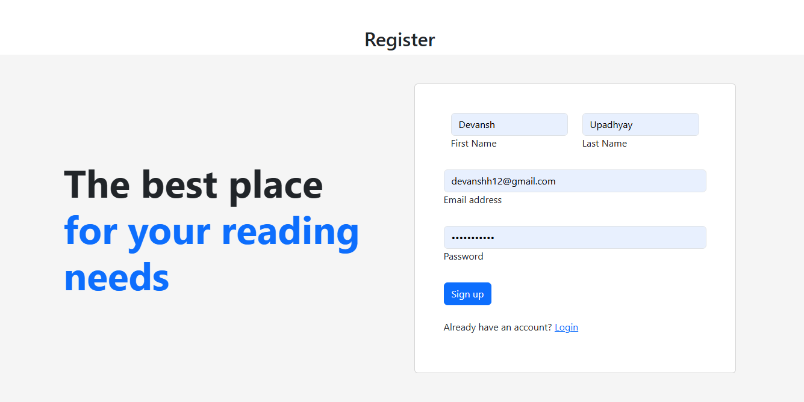
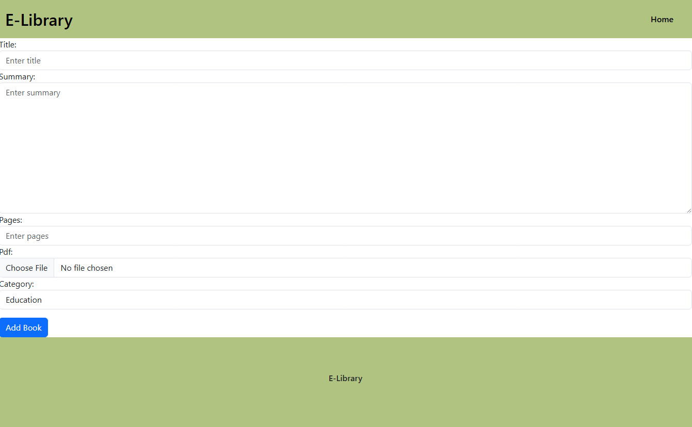
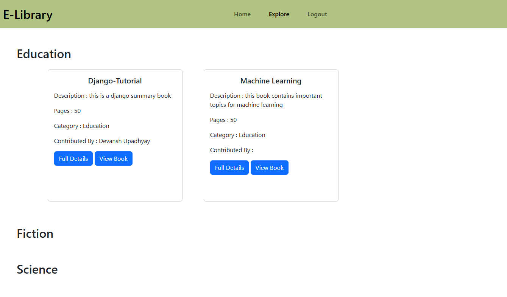

## E-Book Management 

## Description
This is an E Book Management platform where user can Signup/login and explore different kind of books base upon category and user can also contribute to the platform

## Installation
- create a virtual enviroment

- install requirements from requirements.txt

- bash `python manage.py runserver`

## Screenshots

